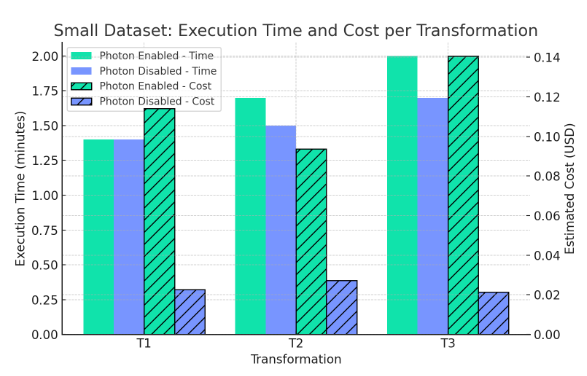

# When is Databricks Photon Worth It?

This repository contains **all synthetic data generation scripts, benchmark queries, transformations, cluster configurations, and performance results** from the blog:

**When is Databricks Photon Worth It?**

---

## Repository Structure

**data_generation/**  
- Synthetic dataset generation scripts for **Scale A, B, C**  
  - Scale A → ~100M users, ~1M products, ~500M transactions  
  - Scale B → ~10M users, ~10M products, ~500M transactions  
  - Scale C → ~10M users, ~1M products, ~5B transactions  

**queries/**  
- **sql/** → SQL versions of all 5 benchmark queries  
- **pyspark/** → PySpark versions of all 5 benchmark queries  
  - Query 1 → Total spending per country  
  - Query 2 → Top products by total sales  
  - Query 3 → Top spenders per country  
  - Query 4 → Average high-value transactions per product category  
  - Query 5 → Monthly sales trend by category  

**transformations/**  
- **bronze_variation_small.py** → Generate Bronze dataset for 100K users, 1M transactions  
- **bronze_variation_large.py** → Generate Bronze dataset for 1M users, 10M transactions  
- **transformation1_basic.py** → Basic enrichment (join, year/month, filter amount > 5)  
- **transformation2_enrichment.py** → Enrichment with categorization + windowed aggregations  
- **transformation3_rolling_metrics.py** → Full enrichment with rolling metrics & dense ranks  
- **transformations_performance_comparison.csv** → Execution time & cost for all transformation variants (T1/T2/T3, small/large datasets, Photon vs. non-Photon)
- **assets/** → Supporting chart for transformation analysis (e.g., execution time vs. cost)  

**cluster_configs/**  
- `cluster_photon_enabled.json` → Photon-enabled job cluster config  
- `cluster_photon_disabled.json` → Standard job cluster config  

**benchmark_results/**  
- `benchmark_results_scale_a.csv` → Query performance & cost for Scale A dataset  
- `benchmark_results_scale_b.csv` → Query performance & cost for Scale B dataset  
- `benchmark_results_scale_c.csv` → Query performance & cost for Scale C dataset  

---

## How to Reproduce the Benchmarks

1. **Generate synthetic datasets**  
   - For large-scale benchmarks → `data_generation/scale_a/b/c_data_generation.py`  
   - For moderate Bronze workloads → `transformations/bronze_variation_small/large.py`  

2. **Deploy clusters**  
   - Use `cluster_configs/` to create both Photon-enabled and Photon-disabled clusters  

3. **Run benchmark queries**  
   - SQL or PySpark versions from `queries/sql` or `queries/pyspark`  

4. **Run transformations**  
   - Apply T1/T2/T3 scripts from `transformations/` on Bronze datasets  

5. **Compare results**  
   - Review `benchmark_results/` for query performance  
   - Review `transformations_performance_comparison.csv` for transformation workloads  

---

## Conclusions

Photon can dramatically speed up Databricks workloads—but not always at a lower cost. Our benchmarks show that on small and medium jobs, Photon often increases cost without delivering meaningful time savings. On large, complex workloads, it can offer both speed and cost benefits, though results vary.

At Zipher, we optimize Photon usage dynamically based on each job’s structure, runtime behavior, and SLA requirements—enabling it only when the performance gains justify the extra spend.

---

For a detailed analysis and interpretation → read the blog post:  
 [When is Databricks Photon Worth It?](https://zipher.cloud/when-is-databricks-photon-worth-it/)

---
